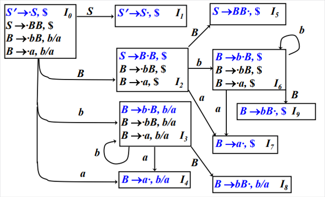

# 一级标题

## 目录

[TOC]


## 标题二

文本

## 标题二

### 标题三

文本

### 标题三

#### 标题四

文本

#### 标题四

##### 标题五

文本

##### 标题五

###### 标题六

文本

###### 标题六

[这是一个链接按钮]()

[这是另一个链接按钮]()

这里是有序列表：

1. 步骤一
2. 步骤二
3. 步骤三

这里是无序列表：

- 项目一
- 项目二
- 项目三

代码块：

```c++
#include<stdio.h>
int main() {
    printf("hello, world!");
    return 0;
}
```

`code-block`

引用块

> 无关风月，我题序等你回。

表格

| 表头1 | 表头2 | 表头3 |
| ----- | ----- | ----- |
| 1     | 2     | 3     |
| 4     | 5     | 6     |

图片



公式
$$
e^{\text{i}\pi}+1=0
$$

