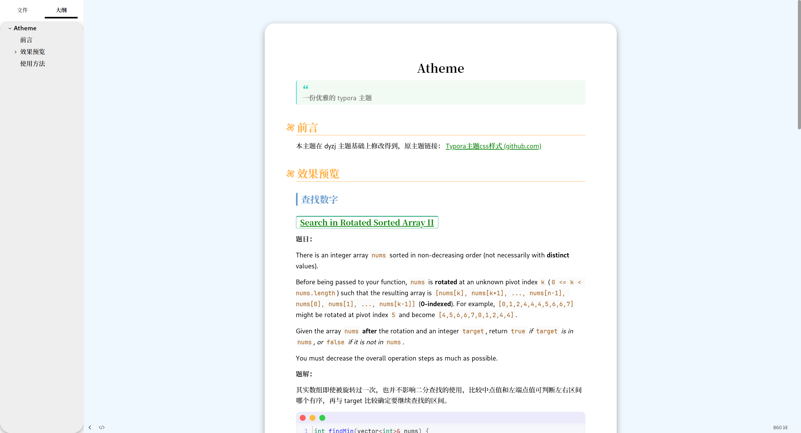
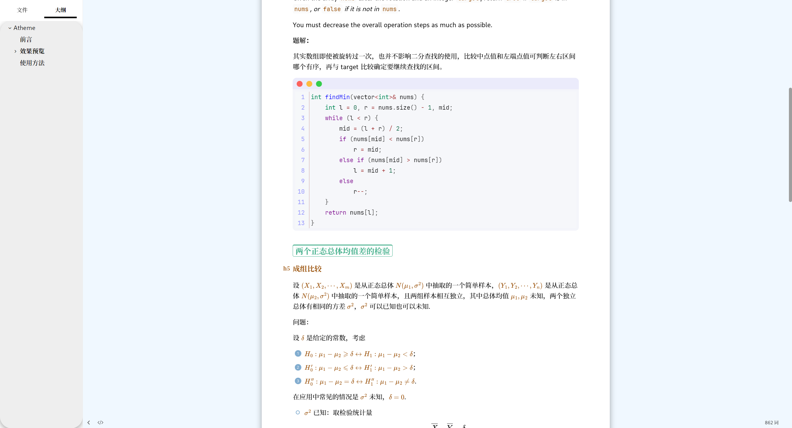
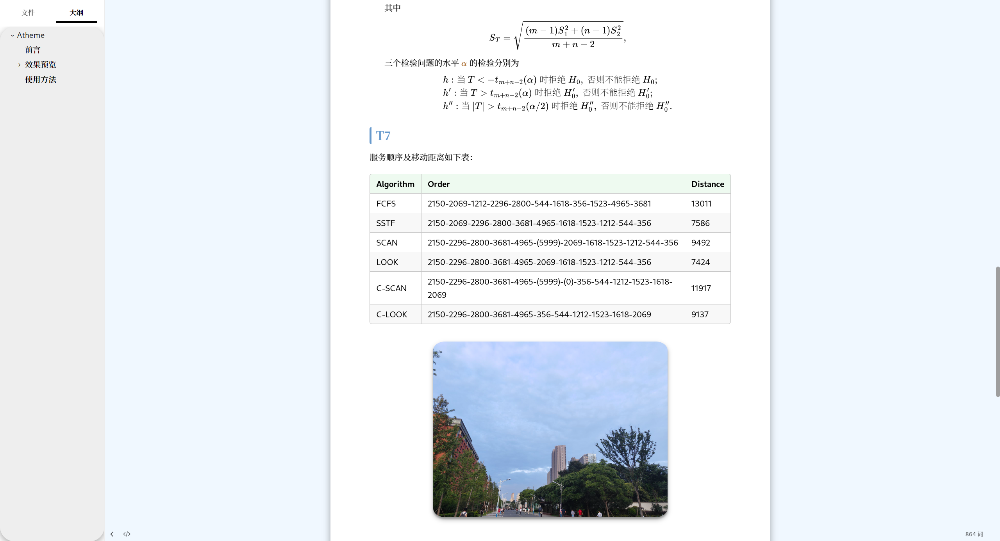

# Atheme

> 一份优雅的 typora 主题

## 前言

本主题在 dyzj 主题基础上修改得到，原主题链接：[Typora主题css样式 (github.com)](https://github.com/muggledy/typora-dyzj-theme)

## 效果预览

## 使用方法

- 下载源码
- 解压压缩包
- 将文件 atheme.css 放入 typora 主题文件夹(菜单栏文件->偏好设置->外观->打开主题文件夹)
- 重启typora，更换主题(Atheme)

> PS：为了轻便，此主题使用的不是本地字体，所以必须在网络状态良好的条件下使用，否则可能打不开。
