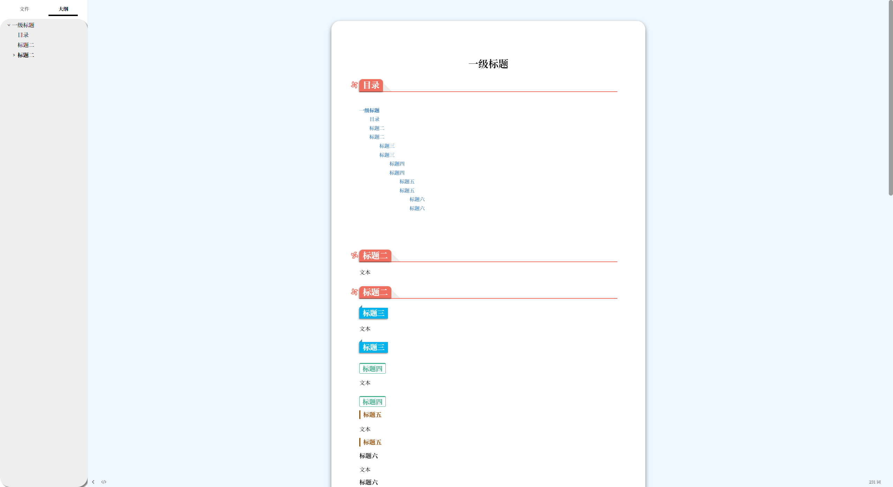
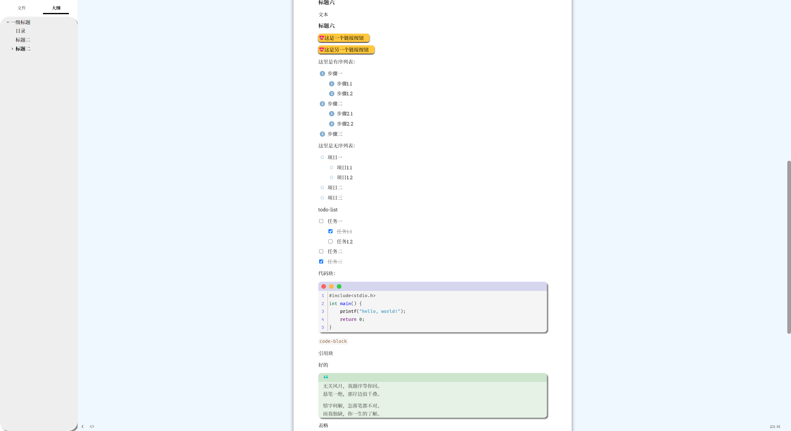
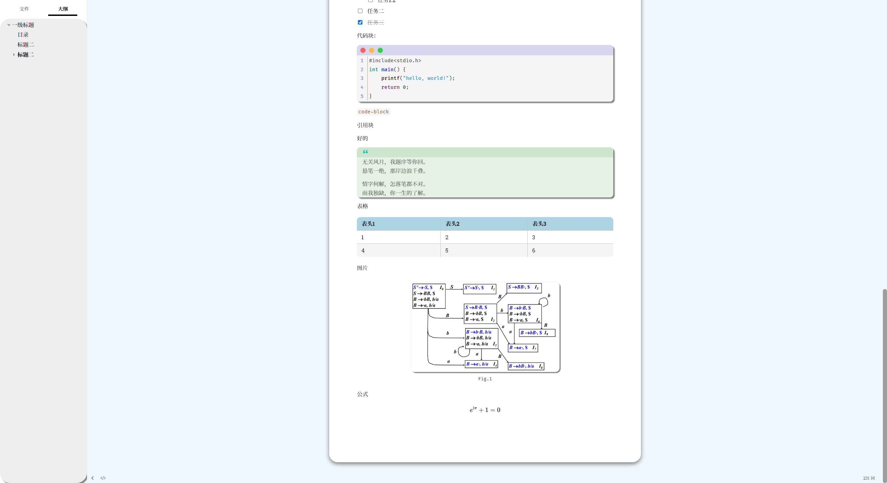
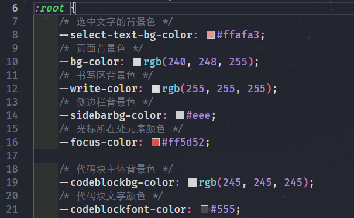

# Atheme

## 效果预览

## 使用方法

- 下载源码
- 解压压缩包
- 将文件 atheme.css 放入 typora 主题文件夹(菜单栏文件->偏好设置->外观->打开主题文件夹)
- 重启typora，更换主题(Atheme)

---

> PS. 为了轻便，此主题使用的不是本地字体，所以必须在网络状态良好的条件下使用，否则可能打不开或无法导出 pdf。

> 本主题可以很方便地修改配色，修改 `atheme.css` 中的如下部分即可：
>
> 
