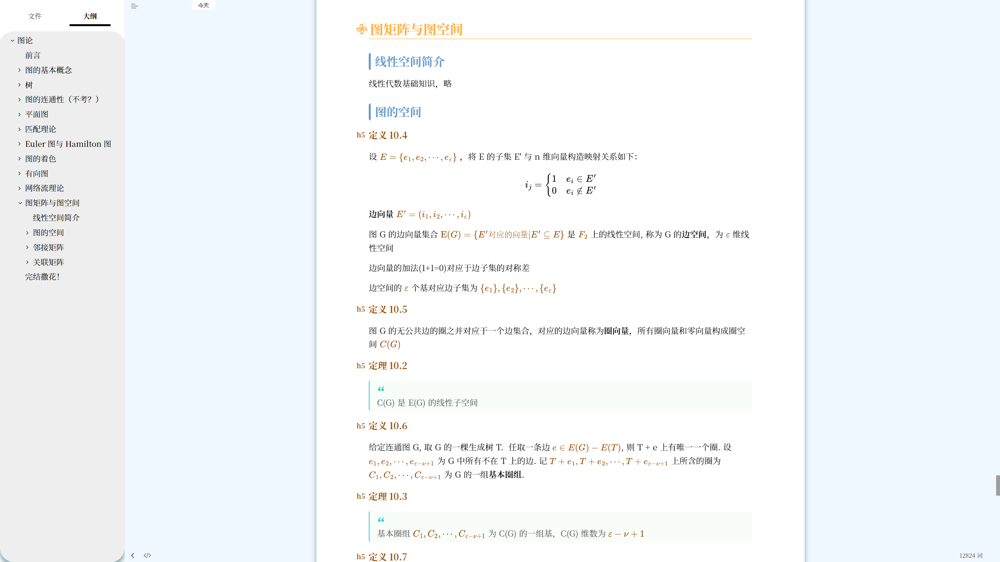
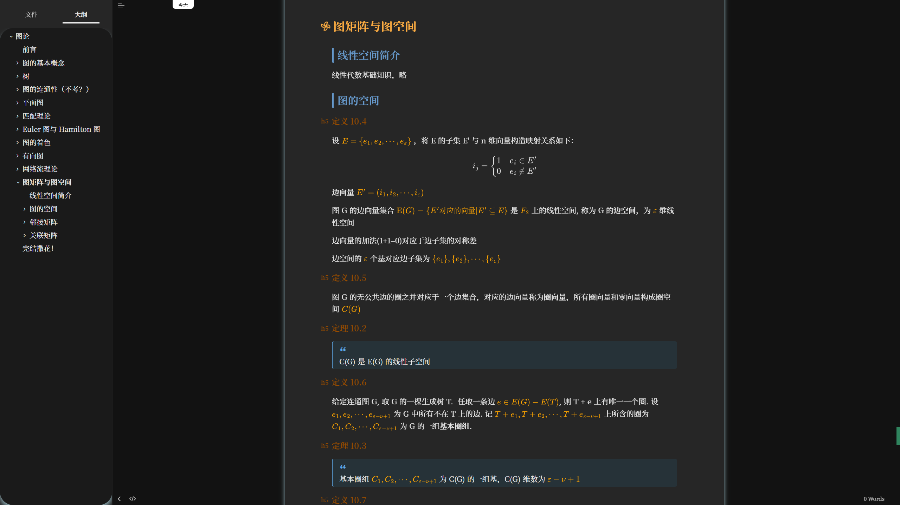
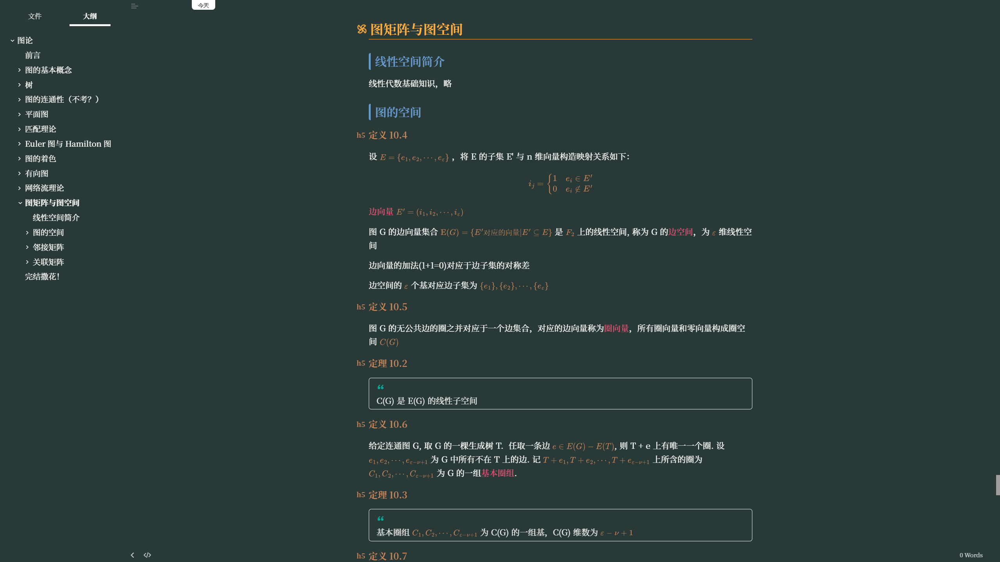

# Atheme

> 一份优雅的 typora 主题

## 前言

本主题在 dyzj 主题基础上修改得到，原主题链接：[Typora主题css样式 (github.com)](https://github.com/muggledy/typora-dyzj-theme)

## 效果预览

#### 正常模式

#### 夜间模式

#### 护眼模式

## 使用方法

1. 下载源码
2. 解压压缩包，得到文件夹 atheme，文件 atheme.css、atheme-dark.css、board.css
3. 全部放入 typora 主题文件夹(文件->偏好设置->外观->打开主题文件夹)
5. 重启typora，更换主题(Atheme或Atheme-dark或Board)
