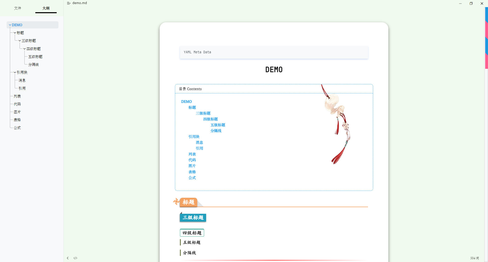
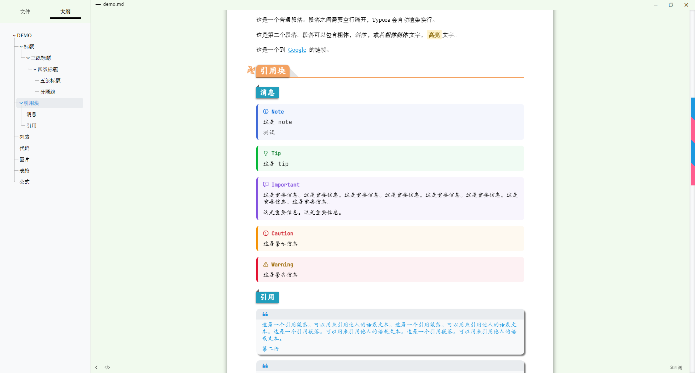
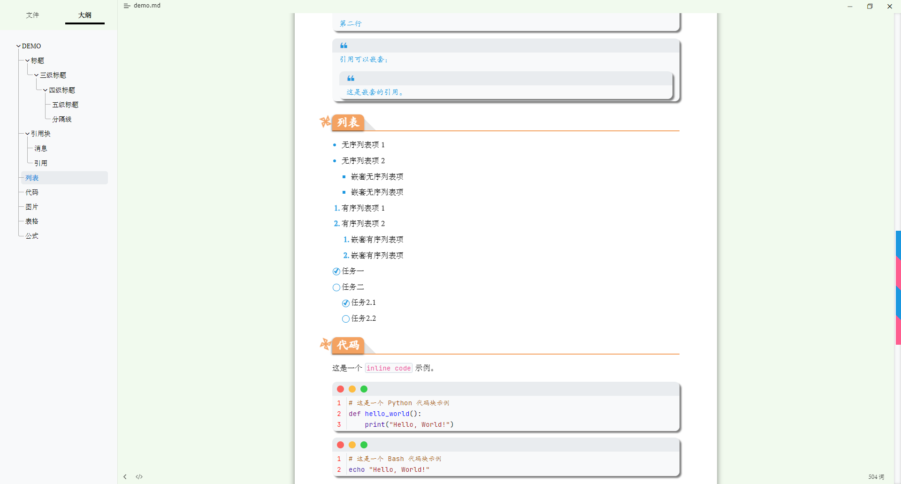
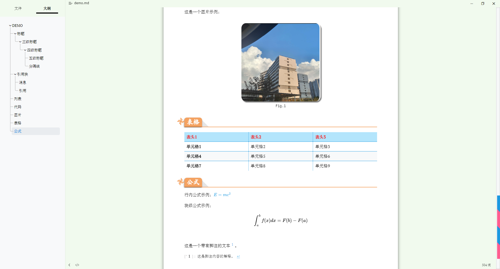
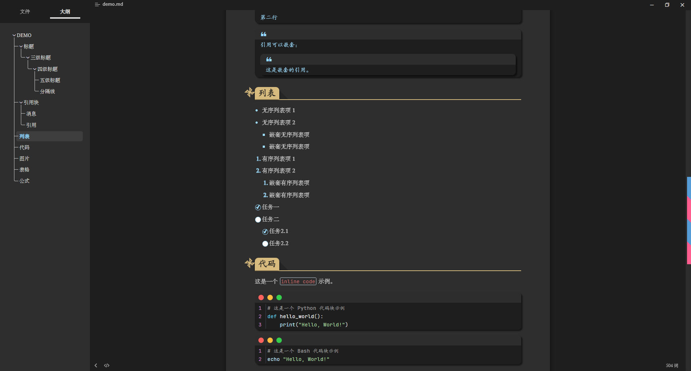
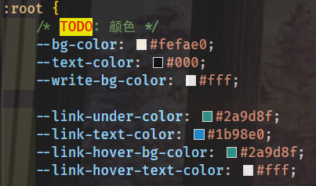

# Atheme

> [!Warning]
>
> 本主题没有原创性可言，是多个优秀主题的缝合之作。本人不是很懂 css，所以也借助了 GPT 的力量，如果发现 bug 请提 issue🙌。

## 预览

（夜间模式，偷懒用 GPT 直接生成的配色😋）

## 安装

### 下载地址

- [Github 项目地址](https://github.com/liano3/Typora-Atheme/) / [一键下载](https://github.com/liano3/Typora-Atheme/archive/refs/heads/main.zip)
- [rec 网盘](https://rec.ustc.edu.cn/share/61bae500-819d-11ef-b1e0-5f239f320514)（不用梯子）

### Typora 设置

> [!NOTE]
>
> 为了 100% 还原预览中展示的效果，可能需要较新版的 Typora 应用，同时开启一些偏好设置。

- 目前版本：Typora for Windows（x64） v1.9.5 
- 偏好设置：
  - [x] 允许折叠和展开侧边栏的大纲视图
  - [x] Markdown 扩展语法 全勾上（Github 风格警报框好像新版才有）
  - [x] 代码块显示行号
  - [x] 窗口样式一体化
  - [x] 导出 PDF 自动使用当前主题

### 使用方法

- 下载源码并解压
- 将文件 sunshine.css，moonlight.css（夜间模式），文件夹 atheme 一起放入 typora 主题文件夹(菜单栏文件->偏好设置->外观->打开主题文件夹)
- 重启typora，更换主题(Sunshine/Moonlight)

> [!TIP]
>
> 本主题可以很方便地修改配色，修改 `sunshine.css` 中的如下部分即可：
>
> 
>
> 本主题比较适合导出 PDF，如果要导出 HTML 建议使用 [mdmdt](https://github.com/cayxc/Mdmdt)

## 参考

- GPT
- [dyzj](https://github.com/muggledy/typora-dyzj-theme)
- [mdmdt](https://github.com/cayxc/Mdmdt)
- [lapis](https://github.com/YiNNx/typora-theme-lapis)
- [neil](https://gitee.com/iwuyc-tools/typora-neil-theme)
- [orange-heart](https://github.com/evgo2017/typora-theme-orange-heart)
- [latex](https://github.com/Keldos-Li/typora-latex-theme)
- ...
