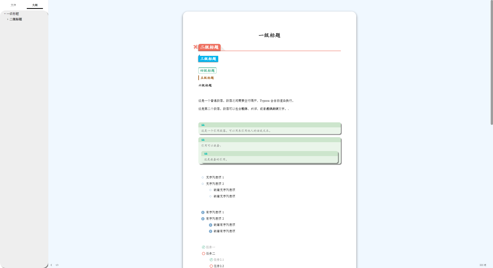
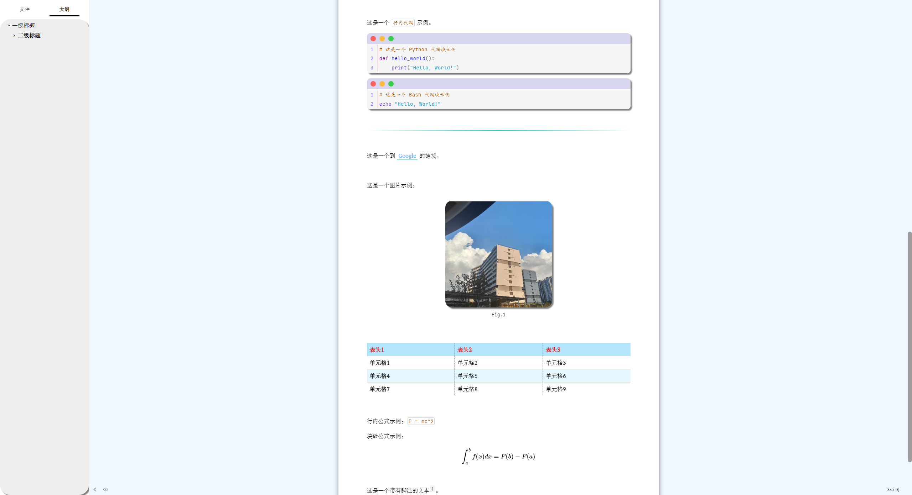

# Atheme

## 效果预览

## 使用方法

- 下载源码并解压
- 将文件 atheme.css，文件夹 atheme 一起放入 typora 主题文件夹(菜单栏文件->偏好设置->外观->打开主题文件夹)
- 重启typora，更换主题(Atheme)

> 本主题可以很方便地修改配色，修改 `atheme.css` 中的如下部分即可：
>
> 

> 本主题样式比较花，如果喜欢简洁风格的可以使用 `latex` 主题。记得下载安装字体：[Keldos-Li](https://github.com/Keldos-Li/typora-latex-theme-fonts)
